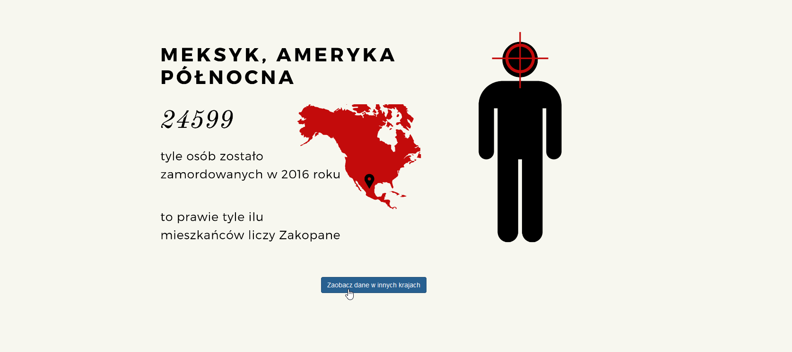
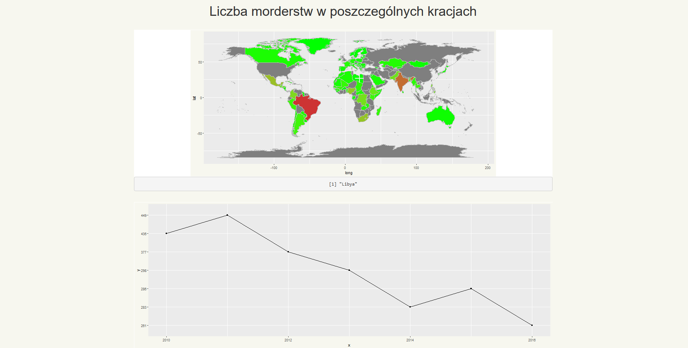
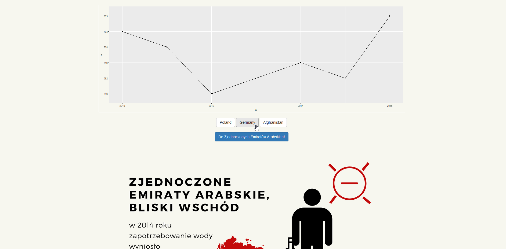
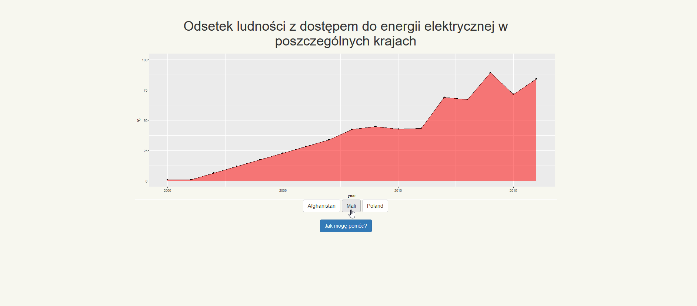
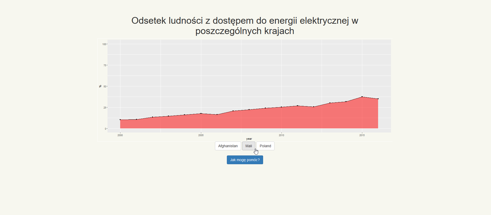

We participated in 24 hours  hackathon organised by polish Central Statistical Office, where based on large amounts of data issued by United Nations, in one night our team created R Shiny web application presenting most important data insights from UN API. Website is in polish because of hackathon requirements.

Below few screenshots form application:

